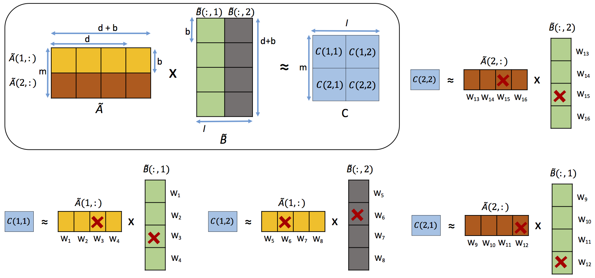

# OverSketch

OverSketch.py function implements OverSketch from 
https://arxiv.org/pdf/1811.02653.pdf

Running these files would require the pywren (http://pywren.io/) and the numpywren (https://github.com/Vaishaal/numpywren) packages to be installed. 

It calculates AxB approximately using sketching on AWS Lambda in a cost-efficient fashion.

Takes arguments: 
1. BigMatrix 'A' 
2. BigMatrix 'B' 
3. sketch dimension 'd', 
4. straggler threshold 'thres', default 0.95 

BigMatrix objects A (m x n) and B (n x l) should satisfy:
1. A.shard_sizes[0] = B.shard_sizes[1] = b, where b is the block-size
2. b should divide d, m and l
3. Columns and rows of A and B, respectively, are unsharded in AWS S3 storage (however, this code can be trivially generalized)

Returns: A numpywren BigMatrix stored in AWS S3 that contains the sketched product of A and B
